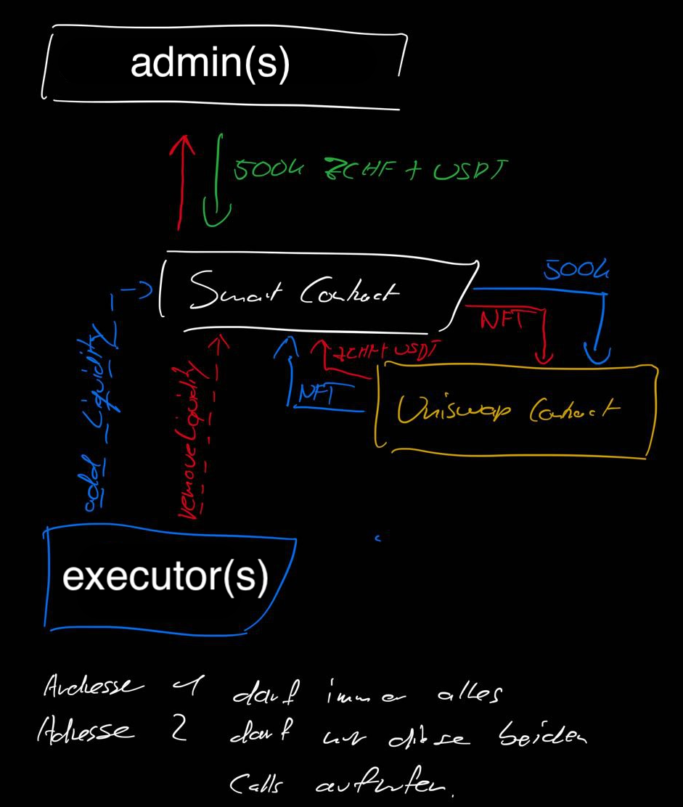

# frankencoin-utils

### Idea of LiquidityController



# Scripts

```json
yarn run ...

"compile": "npx hardhat compile",
"test": "npx hardhat test",
"coverage": "npx hardhat coverage",
"publish": "npm publish --access public"
```

### Deploy & Verify

```bash
npx hardhat ignition deploy ./ignition/modules/LiquidityController.ts --network polygon --deployment-id dep1
npx hardhat verify --network polygon --constructor-args ./ignition/constructor/dep1.js 0x10A0DDB46361b3F1d6405eFffc1Db96771bAb85F
```

> Check out ./ignition/deployments/[deployment]/deployed_addresses.json
> Check out ./ignition/deployments/[deployment]/journal.jsonl

# Version - PoC

### Setup

Add the correct openzepplin solidity version, otherwise it won't compile.

> yarn add @openzeppelin/contracts@3.4.2

```js
// Importent
pragma solidity =0.7.6;
pragma abicoder v2;
```

### Liquidity Controller

`contract LiquidityController is IERC721Receiver, AccessControl {}`

Implements:

-   IERC721Receiver, to receive NFTs
-   AccessControl, for admin(s) and executor(s)

### IERC721Receiver

```js
INonfungiblePositionManager public immutable nonfungiblePositionManager;

// Represents the deposit of an NFT
struct Deposit {
    address token0;
    address token1;
    uint24 fee;
    int24 tickLower;
    int24 tickUpper;
}

// @dev: for storing the NFTs, deposits[tokenId] => Deposit
mapping(uint256 => Deposit) public deposits;
```

### NFT Received (Deposit)

```js
// allows to handle ERC721 aka NFTs, by calling _createDeposit
function onERC721Received(address, address, uint256 tokenId, bytes calldata) external override returns (bytes4) {}

// create a reference to be aware of new minted or received NFTs
function _createDeposit(uint256 tokenId) internal {}
```

### AccessControl

```js
bytes32 public constant ADMIN_ROLE = keccak256('ADMIN_ROLE');
bytes32 public constant EXECUTOR_ROLE = keccak256('EXECUTOR_ROLE');

modifier onlyAdmins() {}
modifier onlyAdminsOrExecutors() {}
```

## AccessControl Functions

```js
// roles
function DEFAULT_ADMIN_ROLE() view returns (bytes32),
function ADMIN_ROLE() view returns (bytes32),
function EXECUTOR_ROLE() view returns (bytes32),

// visibility
function getRoleAdmin(bytes32) view returns (bytes32),
function getRoleMember(bytes32,uint256) view returns (address),
function getRoleMemberCount(bytes32) view returns (uint256),

// check verify function
function hasRole(bytes32,address) view returns (bool),

// give admin control over access
function grantRole(bytes32,address),
function revokeRole(bytes32,address),

// give all control to renounce access
function renounceRole(bytes32,address),
```

## Redeem safety function [admin]

```js
// give admin the ability to redeem any kind of ownership
function redeemOwnership(address toTransfer, address to) external onlyAdmins {}
function redeemToken(address token, address to, uint256 value) external onlyAdmins {}
function redeemNFT(uint256 tokenId, address to) external onlyAdmins {}
```

## Approve / set allowance, transfer helper function [admin]

```js
// allow admins to set the allowance for the NFT pos.manager
function setAllowanceForManager(
    address token0,
    address token1,
    uint256 amount0,
    uint256 amount1
) external onlyAdmins {}

// allow admins to set any allowance (approve proxy)
function setAllowanceTo(address token, address to, uint256 amount) external onlyAdmins {}

// allow admins to transfer for a tokenId deposit
function transferForDeposit(uint256 tokenId, uint256 amount0, uint256 amount1) external onlyAdmins {}
function transferForTokens(address token0, address token1, uint256 amount0, uint256 amount1) public onlyAdmins {}
```

## Mint [admin]

```js
// allow admins to create new positions (deposits). This will call _createDeposit
function mintNewPosition(
    address token0,
    address token1,
    uint24 fee,
    int24 tickLower,
    int24 tickUpper,
    uint256 amount0ToMint,
    uint256 amount1ToMint,
    uint256 amount0Min,
    uint256 amount1Min
) external onlyAdmins returns (uint256 tokenId, uint128 liquidity, uint256 amount0, uint256 amount1) {}
```

## Control [admin/executor]

```js
// give admin/executor the ability to collect fees. admins are allowed to withdraw.
function collectFees(
		uint256 tokenId,
		bool withdraw
	) external onlyAdminsOrExecutors returns (uint256 amount0, uint256 amount1) {}

// give admin/executor the ability to increase the liquidity for a given tokenId (NFT)
function increaseLiquidity(
    uint256 tokenId,
    uint256 amountAdd0,
    uint256 amountAdd1,
    uint256 amount0Min,
    uint256 amount1Min
) external onlyAdminsOrExecutors returns (uint128 liquidity, uint256 amount0, uint256 amount1) {}

// give admin/executor the ability to decrease the liquidity for a given tokenId (NFT)
function decreaseLiquidity(
    uint256 tokenId,
    uint128 liquidity,
    uint256 amount0Min,
    uint256 amount1Min
) external onlyAdminsOrExecutors returns (uint256 amount0, uint256 amount1) {}
```

# Possible Usage

1. Deploy this SC with constructor params.
2. Approve transfers / set allowance
    - token0 -> `ERC20.approve(...)` -> SC
    - token1 -> `ERC20.approve(...)` -> SC
    - `SC:setAllowanceForManager(token0, token1, 1 << 255, 1 << 255);`
    - e.g. for "infinity" approvement
3. `SC:transferForTokens(token0, token1, amount0, amount1);`
4. `SC:mintNewPosition(token0, token1, fee, ...);`
5. `SC:collectFees(tokenId, true); // claim as admin`
6. or collect fees to contract for further use with `false`
